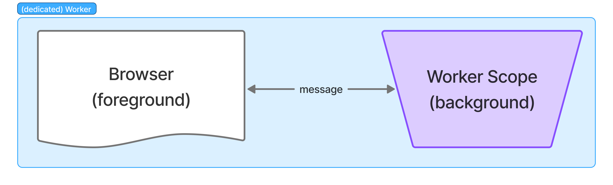

# (Dedicated) Worker

> !
> refer https://developer.mozilla.org/en-US/docs/Web/API/Worker



## Components

### Background; Worker scope

#### `@worker` class decorator (typescript decorator stage3)

Add initializer to setup event handlers, Create singular instance of the target class, to be used at event handling & complete registration.

#### `@on` method decorator (typescript decorator stage3)

Set the method to be the event listener accordingly.

**Available events**: (All lowerCases; As of 2026.Oct.)
- [***DedicatedWorkerGlobalScope***](https://developer.mozilla.org/en-US/docs/Web/API/DedicatedWorkerGlobalScope)
  - `message`
  - `messageerror`
  - `rtctransform`
- [***WorkerGlobalScope***](https://developer.mozilla.org/en-US/docs/Web/API/WorkerGlobalScope)
  - `error`
  - `languagechange`
  - `online`
  - `offline`
  - `rejectionhandled`
  - `securitypolicyviolation`
  - `unhandledrejection`

#### `BaseScope` inheritance (optional)

Wrap DedicatedWorkerGlobalScope properties/methods for ease:

```typescript
declare class BaseScope extends WorkerGlobalScope {

  /* Properties */

  // self:DedicatedWorkerGlobalScope linked properties
  readonly name:string;
  // super;WorkerGlobalScope lined properties
  readonly caches:CacheStorage;
  readonly crossOriginIsolated:boolean;
  readonly crypto:Crypto;
  readonly fonts:FontFaceSet;
  readonly indexedDB:IDBFactory;
  readonly isSecureContext:boolean;
  readonly location:WorkerLocation;
  readonly navigator:WorkerNavigator;
  readonly origin:string;
  readonly performance:Performance;
  readonly scheduler:Scheduler;
  readonly trustedTypes:TrustedTypePolicyFactory;


  /* Methods */
  // DedicatedWorker:BaseScope declared
  postback(response:any, transfers?:any):void;

  // self;DedicatedGlobalWorker linked methods
  close():void;
  postMessage(message:any, transfers?:any):void;
  cancelAnimationFrame(handle:bigint):void; //@throws NotSupportedError
  requestAnimationFrame(callback:(timestamp:DOMHighResTimeStamp)=>any):bigint; //@throws NotSupportedError

  // super;WorkerGlobalScope linked methods
  atob(encodedData:byte[]):string; //@throws InvalidCharacterError
  btoa(stringToEncode:string):byte[]; //@throws InvalidCharacterError
  clearInterval(intervalId:number):void;
  clearTimeout(timeoutId:number):void;
  createImageBitmap(image, sx|options?, sy?, sw?, sh?, options?):Promise<ImageBitmap>;
  dump(message:string):void *non-standard* *deprecated*;
  fetch(resource:string|URL|Request, options?:RequestInit):Promise<Response>; //@throws AbortError, NotAllowedError, TypeError
  importScripts(...urls:TrustedScriptURL[]):void; //@throws NetworkError, SyntaxError, TypeError *TrustedScriptURL only* 
  queueMicrotask(callback:Function):void;
  reportError(throwable:Throwable):void; //@throws TypeError
  setInterval(code:Function|TrustedScript, delay?:number, ...params:any[]):number; //@throws SyntaxError, TypeError
  setTimeout(code:Function|TrustedScript, delay?:number, ...params:any[]):number; //@throws SyntaxError, TypeError
  structuredClone(value:object, options?:{transfer:Array<Transferable>}):object; //@throws DataCloneError
}
```

### Foreground; page scope

#### `register` function

Register the worker connector; Also can be used at sub-worker registration at any worker scope.

```typescript
import { register } from '@dxnlab/workers/dedicated';

declare function register(
  location:string|URL, 
  options?:{
    name?:string,
    credentials?:'include'|'omit'|'same-origin',
    type?:'classic'|'module', // default "module", at register function;

    onError?:EventListener,
    onMessage?:EventListener,
    onMessageError?:EventListener
  }):Worker & {
    // async function to communicate with background worker.
    // **!caution**
    // will forever-waiting if the background worker do not giving a response.
    async post(message:any, transfers?:any):Promise<unknown>;
  }
```

## Example

### Echo
---

Mirror response exact message that worker got.

*Background*

```typescript
/**
* @file dedicated.echo.ts
*/
import { worker, on, BaseScope } from '@dxnlab/workers/dedicated';

@worker
export class DedicatedEchoWorker extends BaseScope {
  @on('message')
  doEchoMessageData({data}) {
    this.postback(data);
  }
}
```

*Foreground*

```typescript
/**
 * @file main.ts
 */

import { register } from '@dxnlab/workers/dedicated';

// get the background worker location
import echoWorkerUrl from './dedicated.echo?url';

const echoWorker = register({
  name: 'echo',
  onMessage: console.log,
  onMessageError: console.warn,
  onError: console.error,
});

const response = await echoWorker.post('ping');

// browser console output
// > [RESPONSE] >> ping
console.log(`[RESPONSE] >> ${response}`);
```

---