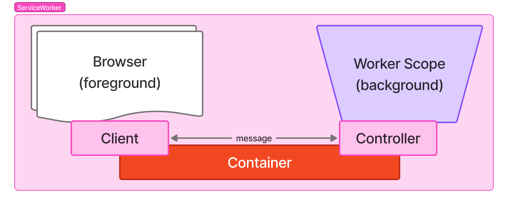

# ServiceWorker

> !
> refer https://developer.mozilla.org/en-US/docs/Web/API/ServiceWorker



A ServiceWorker is a very typical worker type comparison to others ([DedicatedWorker](./dedicated.md), [SharedWorker](./shared.md)). The browser implements a `WorkerContainer` at `Navigtor`, per a service host, that manages any related service workers's installation and versioning, plus, foreground `client` (connector)-background `controller` (worker) bindings.

You should be aware to consider `controller` and `container`/`client`:

*Background*
- `self`:[ServiceWorkerGlobalScope](https://developer.mozilla.org/en-US/docs/Web/API/ServiceWorkerGlobalScope) ~ controller (globalScope)
- `clients.match`:[Client](https://developer.mozilla.org/en-US/docs/Web/API/Client) == client
- `serviceWorker`:[ServiceWorker](https://developer.mozilla.org/en-US/docs/Web/API/ServiceWorker) == controller (worker)
- `navigator.serviceWorker`:[ServiceWorkerContainer](https://developer.mozilla.org/en-US/docs/Web/API/Navigator/serviceWorker) == container

*Foreground*
- `navigator.serviceWorker`:[ServiceWorkerContainer](https://developer.mozilla.org/en-US/docs/Web/API/Navigator/serviceWorker) == container
- return of `navigator.serviceWoker.register()` | `getRegistration()`:[ServiceWorkerRegistration](https://developer.mozilla.org/en-US/docs/Web/API/ServiceWorkerRegistration) <br/>
  ~ Will async resolve `active`|`installing`|`waiting`:[ServiceWorker](https://developer.mozilla.org/en-US/docs/Web/API/ServiceWorker) <br/>
  == controller (worker)


## Components

### Background; ServiceWorker scope

#### `@serviceWorker` class decorator (typescript decorator stage3)

Add initializer to setup event handlers, Create singular instance of the target class, to be used at event handling & complete registration.

ServiceWorker registration is typical comparing to other 2 types. It has installing / versioning / controller changing procedures to get an active registration. When it comes to class initializer, it assume that the worker(controller) once get installed, activated then event listeners attached.


#### `@on` method decorator (typescript decorator stage3)

`SharedWorkerGlobalScope` and/or its `MessagePort` events to be used same at `@on`.

**Avaiable events**: (Case ignored at registration;As of 2026.Oct.)
- [***ServiceWorkerGlobalScope***](https://developer.mozilla.org/en-US/docs/Web/API/SharedWorkerGlobalScope)
  - `message`
  - `messageerror`
  - `activate`
  - `fetch`
  - `push`
  - `pushsubscriptionchange`
  - `sync`
  - `install`
  - `notificationclick`
  - `notificationclose`
  -  *`backgroundfetchabort` *(experimental)*
  -  *`backgroundfetchclick` *(experimental)*
  -  *`backgroundfetchfail` *(experimental)*
  -  *`backgroundfetchsuccess` *(experimental)*
  -  *`canmakepayment` *(experimental)*
  -  *`contentdelete` *(experimental)*
  -  *`paymentrequest` *(experimental)*
  -  *`periodicsync` *(experimental)*
- [***ServiceWorker***](https://developer.mozilla.org/en-US/docs/Web/API/ServiceWorker)
  - `error`
  - `statechange`
- [***WorkerGlobalScope***](https://developer.mozilla.org/en-US/docs/Web/API/WorkerGlobalScope)
  - `languagechange`
  - `online`
  - `offline`
  - `rejectionhandled`
  - `securitypolicyviolation`
  - `unhandledrejection`

#### `BaseScope` inheritance (optional)

```typescript
declare class BaseScope extends WorkerGlobalScope {

    /* Properties */

    // BaseScope aliasing
    readonly controller:ServiceWorker; // === this.serviceWorker
    // self:ServiceWorkerGlobalScope linked properties
    readonly clients:Clients;
    readonly cookieStore:CookieStorage;
    readonly registration:ServiceWorkerRegistration;
    readonly serviceWorker:ServiceWorker;
    // super;WorkerGlobalScope lined properties
    readonly caches:CacheStorage;
    readonly crossOriginIsolated:boolean;
    readonly crypto:Crypto;
    readonly fonts:FontFaceSet;
    readonly indexedDB:IDBFactory;
    readonly isSecureContext:boolean;
    readonly location:WorkerLocation;
    readonly navigator:WorkerNavigator;
    readonly origin:string;
    readonly performance:Performance;
    readonly scheduler:Scheduler;
    readonly trustedTypes:TrustedTypePolicyFactory;
    // self.serviceWorker(=controller) linked properties
    readonly scriptURL:string;
    readonly state: 'parsed'|'installing'|'installed'|'activating'|'activated'|'redundant';

    /* Methods */

    // BascScope implemented
    declare postback(event:any, message:any, transfers?:any):void;
    declare async broadcast(message:any, transfers?:any, matchOptions?:ServiceWorkerClientMatchOption):Promise<void>;

    // self:ServiceWorkerGlobalScope linked method
    declare skipWaiting():Promise<undefined>;

    // self.serviceWorker(=controller) linked properties
    declare postMessage(message:any, transfers?:any):void;

    // super;WorkerGlobalScope linked methods
    atob(encodedData:byte[]):string; //@throws InvalidCharacterError
    btoa(stringToEncode:string):byte[]; //@throws InvalidCharacterError
    clearInterval(intervalId:number):void;
    clearTimeout(timeoutId:number):void;
    createImageBitmap(image, sx|options?, sy?, sw?, sh?, options?):Promise<ImageBitmap>;
    dump(message:string):void *non-standard* *deprecated*;
    fetch(resource:string|URL|Request, options?:RequestInit):Promise<Response>; //@throws AbortError, NotAllowedError, TypeError
    importScripts(...urls:TrustedScriptURL[]):void; //@throws NetworkError, SyntaxError, TypeError *TrustedScriptURL only* 
    queueMicrotask(callback:Function):void;
    reportError(throwable:Throwable):void; //@throws TypeError
    setInterval(code:Function|TrustedScript, delay?:number, ...params:any[]):number; //@throws SyntaxError, TypeError
    setTimeout(code:Function|TrustedScript, delay?:number, ...params:any[]):number; //@throws SyntaxError, TypeError
    structuredClone(value:object, options?:{transfer:Array<Transferable>}):object; //@throws DataCloneError
}
```


### Foreground; page scope

#### `register` function

Register the sharedWorker connector; Also can be used at sub-worker registration at any worker scope.

```typescript
import { register } from '@dxnlab/workers/shared';

declare function register(
    location?:string|URL,
    options?:{
        name?:string,
        credentials?:'include'|'omit'|'same-origin',
        type?:'classic'|'module', // default "module", at register function;

        noAutoStart?:booelan, // "suppressPortStartOnConnect" option at foreground. default "false".

        onError?: EventListener,
        onMessage?: EventListener,
        onMessageError?: EventListener;
    }) : SharedWorker & {
        async post(message:any, transfers?:any):Promise<unknown>;
}
```

## Example

### Broadcast echo
---

> Broadcast any request message that the worker got.

*Background*

```typescript
/**
 * @file shared.broadcast.echo.ts
 */
import { sharedWorker, on, BaseScope } from '@dxnlab/workers/shared';

@sharedWorker
export class BroadcastEchoWorker extends BaseScope {
    @on('message')
    doBroadcastIncommingMessage(event) {
        // send back origin.
        this.postback(event, {
            origin: true,
            data: event.data
        })

        // broadcast to ALL
        this.broadcast({
            origin: false,
            data: event.data
        });

        // As a consequence, the origin foreground responsed the same message twice.
    }
}
```

*Foreground*

```typescript
/**
 * @file main.ts
 */
import { register } from '@dxnlab/workers/shared';
import broadcastWorkerUrl from './shared.broadcast.echo?url';

const sharedWorker = register(broadcastWorkerUrl, {
    name: 'broadcastEcho',
    onMessage({origin, data}) {
        const source = origin ? 'postback' : 'broadcast'
        console.log(`[RESPONSE][${source}] ${data}`);
    },
})

// Can NOT guarantee origin:true 
// resolved as a response, but Probable.
const response = await sharedWorker.post('share!');

// onMessage log to be (order can be altered):
// > [RESPONSE][postback] share!
// > [RESPONSE][broadcast] share!
```

---