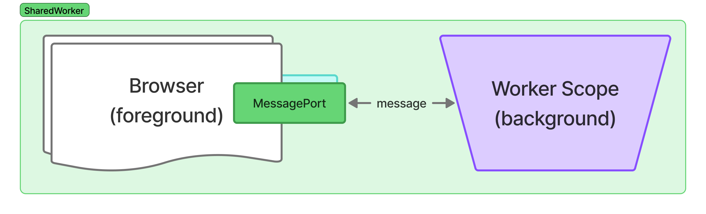

# SharedWorker

> !
> refer https://developer.mozilla.org/en-US/docs/Web/API/SharedWorker



SharedWorker is a worker that to be shared over multiple page session/windows, communicates with other foreground connectors via [MessagePort](https://developer.mozilla.org/en-US/docs/Web/API/MessagePort).

In a standard application, connected ports are not stored in the worker. Therefore it needs to save those ports at `connect` event for inter-communicate thru multiple connectors and/or register port-oriented event listeners.

Compare to [serviceWorker](./service.md), both to be a singular worker that can be shared for multiple session windows, a sharedWorker get focused on central processing & foreground interconnects. Thus, a case when a single integrated worker needed, it's recommended to use `SharedWorker` and another case that requires service-level integration, including local caching, fetch intervention, etc. a `ServiceWorker` can be an appropriate option.

## Components

### Background; SharedWorker scope

#### `@sharedWorker` class decorator (typescript decorator stage3)

Add initializer to setup event handlers, Create singular instance of the target class, to be used at event handling & complete registration.

The @sharedWorker class, also required to have a non-parameterized constructor, however it has options to control how to maintain ports.

```typescript
declare constructor(
    // if "true", a port need to be started manually.
    suppressPortStartOnConnect:boolean=false,
    // if "true", it won't save a port at connect event. 
    // Thus `ports` property & `broadcast` method gets unavailable.
    discardPortSaveOnConnect:boolean=false,
    // if "true" (or "discardPortSaveOnConnect"="true" above), 
    // it won't try to remove port at "close"
    suppressOverrideRemoveOnClose:boolean=false,
    // if "true" (or "discardPortSaveOnConnect"="true" above), 
    // it won't add default `connect` event listener,
    // thus any port-wise events need to be manually handled.
    suppressDefaultOnConnectListener:boolean=false,
)
```

**Typical usage** A case if it needs any initializer routines before starting then save a port.

```typescript
class TypicalSharedWorker extends BaseScope {
    // Always need to have non-parameterized constructor.
    constructor() {
        super(
            true, // suppressPortStartOnConnect
            // let other options leave default "false".
        );
    }

    @on('connect')
    async onConnectInitializer({ports}) {
        const port = Array.from(ports).shift();
        // do some initialization routines
        await preparePort(port);
        // starting port here
        port.start();

        // send 'started' message
        port.postMessage({ started:Date.now() });
    }

    @on('message')
    doHandlingMessage(event) {
        // response back incomming data as-is.
        this.postback(event, event.data);
    }
}
```

#### `@on` method decorator (typescript decorator stage3)

`SharedWorkerGlobalScope` and/or its `MessagePort` events to be used same at `@on`.

**Avaiable events**: (Case ignored at registration;As of 2026.Oct.)
- [***SharedWorkerGlobalScope***](https://developer.mozilla.org/en-US/docs/Web/API/SharedWorkerGlobalScope)
  - `connect`
- [***MessagePort***](https://developer.mozilla.org/en-US/docs/Web/API/MessagePort)
  - `message`
  - `messageerror`
- [***WorkerGlobalScope***](https://developer.mozilla.org/en-US/docs/Web/API/WorkerGlobalScope)
  - `error`
  - `languagechange`
  - `online`
  - `offline`
  - `rejectionhandled`
  - `securitypolicyviolation`
  - `unhandledrejection`

#### `BaseScope` inheritance (optional)

```typescript
declare class BaseScope extends WorkerGlobalScope {

    /* Properties */

    // self:SharedWorkerGlobalScope linked properties
    readonly name:string;
    // super;WorkerGlobalScope lined properties
    readonly caches:CacheStorage;
    readonly crossOriginIsolated:boolean;
    readonly crypto:Crypto;
    readonly fonts:FontFaceSet;
    readonly indexedDB:IDBFactory;
    readonly isSecureContext:boolean;
    readonly location:WorkerLocation;
    readonly navigator:WorkerNavigator;
    readonly origin:string;
    readonly performance:Performance;
    readonly scheduler:Scheduler;
    readonly trustedTypes:TrustedTypePolicyFactory;

    /* Methods */

    // SharedWorker::BaseScope declared

    // optional parameters for the super constructor
    declare constructor(
        suppressPortStartOnConnect:boolean=false,
        discardPortSaveOnConnect:boolean=false,
        suppressOverrideRemoveOnClose:boolean=false,
        suppressDefaultOnConnectListener:boolean=false,
    );
    // postback to (requested) foreground worker
    declare postback(messageEvent:MessageEvent, message:any, transfers?:any):void;
    // broadcast upon ALL foreground workers
    declare broadcast(message:any, transfers?:any, ports?:Array<number|MessagePort>):void;

    // super;WorkerGlobalScope linked methods
    atob(encodedData:byte[]):string; //@throws InvalidCharacterError
    btoa(stringToEncode:string):byte[]; //@throws InvalidCharacterError
    clearInterval(intervalId:number):void;
    clearTimeout(timeoutId:number):void;
    createImageBitmap(image, sx|options?, sy?, sw?, sh?, options?):Promise<ImageBitmap>;
    dump(message:string):void *non-standard* *deprecated*;
    fetch(resource:string|URL|Request, options?:RequestInit):Promise<Response>; //@throws AbortError, NotAllowedError, TypeError
    importScripts(...urls:TrustedScriptURL[]):void; //@throws NetworkError, SyntaxError, TypeError *TrustedScriptURL only* 
    queueMicrotask(callback:Function):void;
    reportError(throwable:Throwable):void; //@throws TypeError
    setInterval(code:Function|TrustedScript, delay?:number, ...params:any[]):number; //@throws SyntaxError, TypeError
    setTimeout(code:Function|TrustedScript, delay?:number, ...params:any[]):number; //@throws SyntaxError, TypeError
    structuredClone(value:object, options?:{transfer:Array<Transferable>}):object; //@throws DataCloneError
}
```


### Foreground; page scope

#### `register` function

Register the sharedWorker connector; Also can be used at sub-worker registration at any worker scope.

```typescript
import { register } from '@dxnlab/workers/shared';

declare function register(
    location?:string|URL,
    options?:{
        name?:string,
        credentials?:'include'|'omit'|'same-origin',
        type?:'classic'|'module', // default "module", at register function;

        noAutoStart?:booelan, // "suppressPortStartOnConnect" option at foreground. default "false".

        onError?: EventListener,
        onMessage?: EventListener,
        onMessageError?: EventListener;
    }) : SharedWorker & {
        async post(message:any, transfers?:any):Promise<unknown>;
}
```

## Example

### Broadcast echo
---

> Broadcast any request message that the worker got.

*Background*

```typescript
/**
 * @file shared.broadcast.echo.ts
 */
import { sharedWorker, on, BaseScope } from '@dxnlab/workers/shared';

@sharedWorker
export class BroadcastEchoWorker extends BaseScope {
    @on('message')
    doBroadcastIncommingMessage(event) {
        // send back origin.
        this.postback(event, {
            origin: true,
            data: event.data
        })

        // broadcast to ALL
        this.broadcast({
            origin: false,
            data: event.data
        });

        // As a consequence, the origin foreground responsed the same message twice.
    }
}
```

*Foreground*

```typescript
/**
 * @file main.ts
 */
import { register } from '@dxnlab/workers/shared';
import broadcastWorkerUrl from './shared.broadcast.echo?url';

const sharedWorker = register(broadcastWorkerUrl, {
    name: 'broadcastEcho',
    onMessage({origin, data}) {
        const source = origin ? 'postback' : 'broadcast'
        console.log(`[RESPONSE][${source}] ${data}`);
    },
})

// Can NOT guarantee origin:true 
// resolved as a response, but Probable.
const response = await sharedWorker.post('share!');

// onMessage log to be (order can be altered):
// > [RESPONSE][postback] share!
// > [RESPONSE][broadcast] share!
```

---